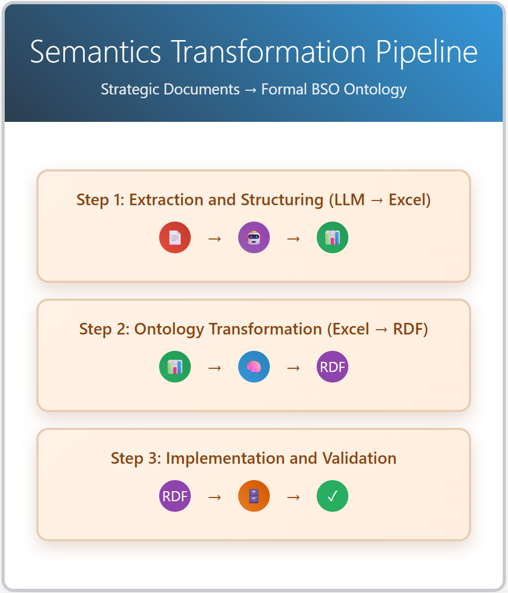

# ICEDEG 2026 — Balanced Scorecard Ontology Implementation in Portuguese Public Administration

**Peer-Reviewed Conference Paper · 12th International Conference on eDemocracy & eGovernment (ICEDEG 2026) · Lisbon, Portugal · 9 July 2026**
**Author:** Rui Vitorino · [LinkedIn](https://www.linkedin.com/in/rui-jv-vitorino/) · [Portfolio](https://rjvvitorino-web.github.io)
**Co-authors:** António Lorvão Antunes, Elsa Cardoso, José Barateiro, Ana Maria de Almeida
**Affiliation:** Instituto Universitário de Lisboa (ISCTE-IUL) · ISTAR · Universidade do Algarve (FCT-UAlg)
**Publisher:** IEEE

> **Related work:** This paper formalizes and extends the [BSO-SG-Gov](https://github.com/rjvvitorino-web/BSO-SG-Gov) MSc thesis implementation into a peer-reviewed empirical study — the first DSR iteration of an ongoing PhD research programme.

---

## Overview

This paper reports an empirical implementation of the Balanced Scorecard Ontology (BSO) at Portugal's Secretaria-Geral do Governo (SG-Gov) — a Portuguese central government agency — examining whether semantic web technologies can address the structural weaknesses that have historically limited the Balanced Scorecard's effectiveness in the public sector. It is the first BSO deployment in Portuguese central public administration and constitutes the pilot Design Science Research (DSR) iteration of an ongoing PhD programme at ISCTE-IUL.

## The Problem

The classical Balanced Scorecard has long struggled to deliver on its strategic-management promise in government settings. Cause-effect relationships between strategic objectives are typically asserted narratively rather than validated, gap detection relies on manual review, and prior research has documented a persistent divergence between how effective managers *perceive* their BSC to be and what the underlying performance data actually shows. These weaknesses compound in the public sector, where accountability requirements demand strategic claims be grounded in verifiable evidence rather than assumption.

## Architecture / Approach

The study formalizes SG-Gov's full strategic architecture as an OWL/RDF ontology through a three-stage semantic transformation pipeline:

| Stage | Process |
|---|---|
| **1. Extraction & Structuring** | An LLM converts unstructured strategic documents (strategic plans, activity plans, activity reports) into structured Excel data, using document-type-specific prompt templates |
| **2. Ontology Transformation** | Excel data is transformed into formal RDF via Protégé and the Cellfie plugin |
| **3. Implementation & Validation** | The ontology is deployed in GraphDB and integrated with a seven-level Power BI analytical dashboard |



Systematic querying — a library of 15 SPARQL queries across six analytical levels — surfaced structural gaps invisible to manual review, including objectives lacking indicators, indicators lacking target values, and unvalidated cause-effect logic.

## Key Design Decisions

1. **Single indicator class.** All performance indicators were modeled as one OWL class, resolving typological inconsistencies found across years of source documents.
2. **Gaps retained, not excluded.** Strategic objectives lacking indicators were kept as valid ontological instances with explicit SHACL annotations flagging their gap status — preserving structural integrity while making deficiencies formally visible.
3. **Complexity abstracted from end users.** The GraphDB → Excel → Power BI pipeline was designed so non-technical managers interact with a familiar dashboard, never the underlying ontology.

## Outcomes

**Technical validation** (HermiT reasoner, SHACL, SPARQL performance):

| Dimension | Result |
|---|---|
| Logical Consistency | Confirmed — 0 OWL inconsistencies |
| Structural Conformance | Confirmed — 0 critical violations |
| Operational Stability | Confirmed — sustained across full test |

**Empirical validation** (3 organizational profiles, SUS + NPS + BSO-specific instrument):

| Profile | Completion | SUS Score | Satisfaction |
|---|---|---|---|
| Senior Management | 100% | 97.5 | 4.8/5.0 |
| Strategic Analysis | 96% | 85.0 | 4.7/5.0 |
| Technical Support | 92% | 80.0 | 4.4/5.0 |
| **Average** | **96%** | **87.5** | **4.6/5.0** |

**Ontology scale:** 15 strategic objectives · 43 performance indicators · 51 cause-effect relationships · 30+ automatically identified strategic gaps (more than twice the yield of manual review)

## Technology Stack

`Protégé 5.6.4` `Cellfie` `OWL/RDF` `GraphDB 10.6.2` `SPARQL` `HermiT Reasoner` `SHACL` `Power BI` `LLM-assisted extraction` `Design Science Research`

## Repository Contents

```
icedeg-2026-bso/
│
├── README.md                       ← This file
│
└── architecture/
    └── Fig1_Pipeline.png           ← Semantic transformation pipeline diagram
```

**Full paper:** Available via IEEE Xplore *(DOI to be added upon publication)*
**Conference presentation:** [Watch on Google Drive](https://drive.google.com/file/d/1gcc8gTsb4G2Ym8fWECLVvd9Vae_I8_kz/view?usp=drive_link)

---

## Access & Contact

This paper extends the [BSO-SG-Gov](https://github.com/rjvvitorino-web/BSO-SG-Gov) implementation into a peer-reviewed empirical study. Full implementation details, ontology files, and SPARQL queries are maintained privately alongside that repository. Researchers and practitioners interested in collaboration or access are welcome to connect via LinkedIn.

Full documentation is maintained privately. Available on request.

**[Connect on LinkedIn →](https://www.linkedin.com/in/rui-jv-vitorino/)**
